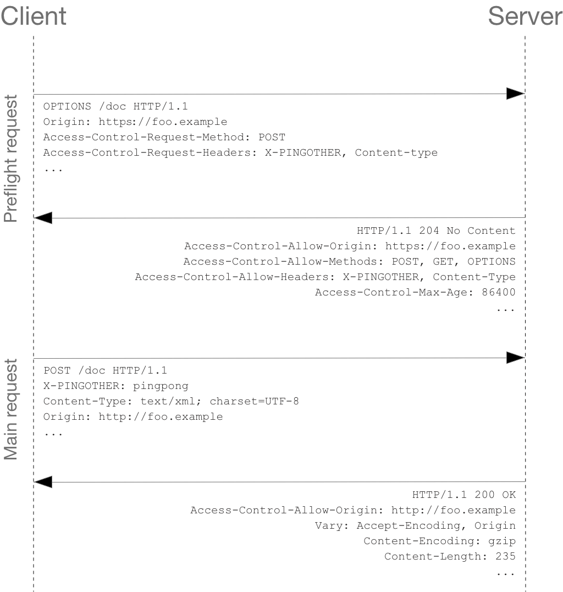

# CORS (Cross-Origin Resource Sharing)

- CORS is a HTTP-header based mechanism that allows a server to indicate any origins (domain, scheme, or port) other than its own **from which a browser should permit loading resources**.

- CORS relies on a mechanism by which browsers make a **preflight request** to the server hosting the cross-origin resource, in order to check that the server will permit the actual request.

- In that preflight, the browser sends headers that indicate the HTTP method and headers that will be used in the actual request.

- The CORS mechanism supports **secure cross-origin requests** and **data transfers between browsers and servers**. Browsers use CORS in APIs such as `fetch()` or `XMLHttpRequest` to mitigate the risks of cross-origin HTTP requests.


- An example of a _cross-origin request_
  > The front-end JavaScript code served from `https://domain-a.com` uses `fetch()` to make a request for `https://domain-b.com/data.json`
  > For security reasons, browsers restrict cross-origin HTTP requests initiated from scripts. For example, `fetch()` and `XMLHttpRequest` follow the **same-origin policy**.
  > This means that a web application using those APIs can only request resources from the same origin the application was loaded from unless the response from other origins includes the right CORS headers.

## Functional Overview

- The CORS standard works by adding new **HTTP headers** that lets **servers** describe which origins are permitted to read that information from a web browser.

- For HTTP request methods that can cause side-effects on server data (non-simple requests), the specification mandates that browsers **preflight** the request, retrieving supported methods from the server with the **HTTP OPTIONS** request method, and then, upon "approval" from the server, sending the actual request.

- Servers can also inform clients where "credentials" (such as Cookies and HTTP Authentication) should be sent with requests.

## Examples of Access Control scenarios

### Simple Requests

- Simple requests don't trigger a CORS Preflight.

- The `<form>` element (which predates cross-site `fetch()` and `XMLHttpRequest`) can submit simple requests to any origin, so anyone writing a server **must already be protecting against cross-site request forgery (CSRF)**.

- For CORS, the server must use `Access-Control-Allow-Origin` to share the response with the script.

- A **Simple Request** is one that meets **all of the following conditions**:
  - Methods: `GET`, `HEAD` and `POST`
  - Headers (manually set): `Accept`, `Accept-Language`, `Content-Language`, `Content-Type`, and `Range`
  - MIME types allowed for `Content-Type` header: `application/x-www-form-urlencoded`, `multipart/form-data`, `text/plain`

---

- For example, suppose web content at `https://foo.example` wishes to fetch JSON content from domain `https://bar.other`. Code of this sort might be used in JavaScript deployed on `foo.example`:

```js
const fetchPromise = fetch('https://bar.other');

fetchPromise
  .then((response) => response.json())
  .then((data) => {
    console.log(data);
  });
```

- This operation performs a simple exchange between the client and the server, using CORS headers to handle the privileges:


- Let's look at what the browser will send to the server in this case:

```sh
GET /resources/public-data/ HTTP/1.1
Host: bar.other
User-Agent: Mozilla/5.0 (Macintosh; Intel Mac OS X 10.14; rv:71.0) Gecko/20100101 Firefox/71.0
Accept: text/html,application/xhtml+xml,application/xml;q=0.9,*/*;q=0.8
Accept-Language: en-us,en;q=0.5
Accept-Encoding: gzip,deflate
Connection: keep-alive
Origin: https://foo.example
```

- The request header is `Origin`, which shows that the invocation is coming from `https://foo.example`

- Server responds with:

```sh
HTTP/1.1 200 OK
Date: Mon, 01 Dec 2008 00:23:53 GMT
Server: Apache/2
Access-Control-Allow-Origin: *
Keep-Alive: timeout=2, max=100
Connection: Keep-Alive
Transfer-Encoding: chunked
Content-Type: application/xml

[…XML Data…]
```

- In responds, the server returns a `Access-Control-Allow-Origin: *` header which means that the resource can be accessed by **any origin**.

- If the resource owners at `https://bar.other` wished to restrict access to the resource to requests only from `https://foo.example` (i.e., no other domain other than `https://foo.example` can access the resource in a cross-origin manner), they would send:

  - `Access-Control-Allow-Origin: https://foo.example`

- **NOTE**: When responding to a credentialed request (HTTP request that includes credentials such as Cookies, Authorization headers (e.g., Bearer tokens), TLS client certificates), the server **must** specify an origin in the value of the `Access-Control-Allow-Origin` header, instead of specifying the "`*`" wildcard.

---

### Preflighted Requests

- Unlike simple requests, for "preflighted" requests, the browser first sends an HTTP request using the `OPTIONS` method to the resource on the other origin, in order to determine if the actual request is safe to send.

- Such cross-origin requests are preflighted since they may have implications for user data.

- The following is an example of a request that will be preflighted:

```js
const fetchPromise = fetch('https://bar.other/doc', {
  method: 'POST',
  mode: 'cors',
  headers: {
    'Content-Type': 'text/xml',
    'X-PINGOTHER': 'pingpong',
  },
  body: '<person><name>Arun</name></person>',
});

fetchPromise.then((response) => {
  console.log(response.status);
});
```

- The example above creates an XML body to send with the `POST` request. Also, a non-standard HTTP `X-PINGOTHER` request header is set. Such headers are not part of HTTP/1.1 but are generally useful to web applications. Since the request uses a `Content-Type` of `text/xml`, and since a custom header is set, this request is preflighted.



- Let's look at the full exchange between client and server. The first exchange is the _preflight request/response_.

```sh
OPTIONS /doc HTTP/1.1
Host: bar.other
User-Agent: Mozilla/5.0 (Macintosh; Intel Mac OS X 10.14; rv:71.0) Gecko/20100101 Firefox/71.0
Accept: text/html,application/xhtml+xml,application/xml;q=0.9,*/*;q=0.8
Accept-Language: en-us,en;q=0.5
Accept-Encoding: gzip,deflate
Connection: keep-alive
Origin: https://foo.example
Access-Control-Request-Method: POST
Access-Control-Request-Headers: content-type,x-pingother

HTTP/1.1 204 No Content
Date: Mon, 01 Dec 2008 01:15:39 GMT
Server: Apache/2
Access-Control-Allow-Origin: https://foo.example
Access-Control-Allow-Methods: POST, GET, OPTIONS
Access-Control-Allow-Headers: X-PINGOTHER, Content-Type
Access-Control-Max-Age: 86400
Vary: Accept-Encoding, Origin
Keep-Alive: timeout=2, max=100
Connection: Keep-Alive
```

- Lines 1 - 10 above represent the preflight request with the `OPTIONS` method. The browser determines that it needs to send this based on the request parameters that the JavaScript code snippet above was using, so that the server can respond with the actual request parameters.

- `OPTIONS` is an HTTP/1.1 method that is used to determine further information from servers, and is a **safe method**, meaning that is can't be used to change the resource.

- Along with the `OPTIONS` request, 2 other request headers are sent:

```sh
Access-Control-Request-Method: POST
Access-Control-Request-Headers: content-type,x-pingother
```

- The `Access-Control-Request-Method` header notifies the server as part of a preflight request that when the actual request is sent, it will do so with a `POST` request method.

- The `Access-Control-Request-Headers` header notifies the server that when the actual request is sent, it will do so with `X-PINGOTHER` and `Content-Type` custom headers.

- Now, the server has an opportunity to determine whether it can accept a request under these conditions.

- Lines 12 - 21 above are the response that the server returns, which indicate that the request method `POST` and request headers `X-PINGOTHER` are acceptable.

```sh
Access-Control-Allow-Origin: https://foo.example
Access-Control-Allow-Methods: POST, GET, OPTIONS
Access-Control-Allow-Headers: X-PINGOTHER, Content-Type
Access-Control-Max-Age: 86400
```

- The server response with `Access-Control-Allow-Origin: https://foo.example`, restricting access to the requesting origin domain only.

- The server also responds with `Access-Control-Allow-Method`, which says that `POST` and `GET` are valid methods to query the resource in question (this header is similar to the `Allow` response header, but used strictly within the context of access control).

- The server also sends `Access-Control-Allow-Headers` with a valid of `X-PINGOTHER, Content-Type`, confirming that these are permitted headers to be used within the actual request.

- The server also sends `Access-Control-Max-Age` which gives the value in seconds for how long the response to the preflight request can be cached without sending another preflight request. The default value is 5 seconds. In the present case, the max age is 86400 seconds (= 24 hours). Each browser has a maximum internal value that takes precedence when the `Access-Control-Max-Age` exceeds it.

- Once the preflight request is completed, the real request is sent:

```sh
POST /doc HTTP/1.1
Host: bar.other
User-Agent: Mozilla/5.0 (Macintosh; Intel Mac OS X 10.14; rv:71.0) Gecko/20100101 Firefox/71.0
Accept: text/html,application/xhtml+xml,application/xml;q=0.9,*/*;q=0.8
Accept-Language: en-us,en;q=0.5
Accept-Encoding: gzip,deflate
Connection: keep-alive
X-PINGOTHER: pingpong
Content-Type: text/xml; charset=UTF-8
Referer: https://foo.example/examples/preflightInvocation.html
Content-Length: 55
Origin: https://foo.example
Pragma: no-cache
Cache-Control: no-cache

<person><name>Arun</name></person>

HTTP/1.1 200 OK
Date: Mon, 01 Dec 2008 01:15:40 GMT
Server: Apache/2
Access-Control-Allow-Origin: https://foo.example
Vary: Accept-Encoding, Origin
Content-Encoding: gzip
Content-Length: 235
Keep-Alive: timeout=2, max=99
Connection: Keep-Alive
Content-Type: text/plain

[Some XML payload]
```

---

### Preflighted requests and redirects

- Not all browsers currently support following redirects after a preflighted request. If a redirect occurs after such a request, some browsers currently will report an error message such as the following:

> The request was redirected to https://example.com/foo, which is disallowed for cross-origin requests that require preflight. Request requires preflight, which is disallowed to follow cross-origin redirects.

- The CORS protocol originally required that behavior that was subsequently changed to no longer require it [Link](https://github.com/whatwg/fetch/commit/0d9a4db8bc02251cc9e391543bb3c1322fb882f2). However, now all browsers have implemented the change, and thus still exhibit the originally required behavior.

- Until browsers catch up with the spec, may be able yo work around this limitation by doing one or both of the following:

  - Change the server-side behavior to avoid the preflight and/or to avoid the redirect
  - Change the request such that it is a _simple request_ that does not cause a preflight.

- If that's not possible, then another way is to:

  1. Make a simple request (using `Response.url`) for the Fetch API or `XMLHttpRequest.responseURL` to determine what the URL the real preflighted request would end up at.
  2. Make another request (the _real_ request) using the URL you obtained from `Response.url` or `XMLHttpRequest.responseURL` in the first step.

- However, if the request is one that triggers a preflight due to the presence of the `Authorization` header in the request or sending Cookies, you won't be able to work around the limitation using the steps above. And you won't be able too work around at all unless you have control over the server the request is being made to.

---

## Request with Credentials

- **NOTE**: When making credentialed requests to a different domain, third-party cookie policies will still apply. The policy always enforced regardless of any setup on the server and the client.

- By default, in cross-origin `fetch()` or `XMLHttpRequest` calls, browsers will not send credentials.

- To ask for a `fetch()` request to include credentials, set the `credentials` option in the `Request()` constructor to "include".

- To ask for an `XMLHttpRequest` request to include credentials, set the `XMLHttpRequest.withCredentials` property to `true`.

- In the example below, content originally loaded from `https://foo.example` makes a simple GET request to a resource on `https://bar.other` which sets Cookies. Content on foo.example might contain JavaScript like this:

```js
const url = 'https://bar.other/resources/credentialed-content/';

const request = new Request(url, { credentials: 'include' });

const fetchPromise = fetch(request);
fetchPromise.then((response) => console.log(response));
```

- This code creates a `Request` object, setting the credentials option to "include" in the constructor, then passes this request into `fetch()`. Since this is a simple `GET` request, it is not preflighted but the browser will **reject** any response that does not have the `Access-Control-Allow-Credentials: true` header, and **not** make the response available to the invoking web content.


- Here is a sample exchange between client and server:

```sh
GET /resources/credentialed-content/ HTTP/1.1
Host: bar.other
User-Agent: Mozilla/5.0 (Macintosh; Intel Mac OS X 10.14; rv:71.0) Gecko/20100101 Firefox/71.0
Accept: text/html,application/xhtml+xml,application/xml;q=0.9,*/*;q=0.8
Accept-Language: en-us,en;q=0.5
Accept-Encoding: gzip,deflate
Connection: keep-alive
Referer: https://foo.example/examples/credential.html
Origin: https://foo.example
Cookie: pageAccess=2

HTTP/1.1 200 OK
Date: Mon, 01 Dec 2008 01:34:52 GMT
Server: Apache/2
Access-Control-Allow-Origin: https://foo.example
Access-Control-Allow-Credentials: true
Cache-Control: no-cache
Pragma: no-cache
Set-Cookie: pageAccess=3; expires=Wed, 31-Dec-2008 01:34:53 GMT
Vary: Accept-Encoding, Origin
Content-Encoding: gzip
Content-Length: 106
Keep-Alive: timeout=2, max=100
Connection: Keep-Alive
Content-Type: text/plain

[text/plain payload]
```

- Although line 10 contains the Cookie destined for the content on `https://bar.other`, if bar.other did not respond with an `Access-Control-Allow-Credentials: true` (line 16), the response would be ignored and not made available to the web content.

## Preflight requests and credentials

- CORS-preflight requests must never include credentials. The response to a preflight request must specify `Access-Control-Allow-Credentials: true` to indicate that the actual request can be made with credentials.

## Credentialed requests and wildcards

When responding to a credentialed request:

- The server **must not** specify the "`*`" wildcard for the `Access-Control-Allow-Origin` response header value, but must instead specify an explicit origin; for example: `Access-Control-Allow-Origin: https://example.com`

- The server **must not** specify the "`*`" wildcard for the `Access-Control-Allow-Headers` response-header value, but must instead specify an explicit list of header names; for example, `Access-Control-Allow-Headers: X-PINGOTHER, Content-Type`

- The server **must not** specify the "`*`" wildcard for the `Access-Control-Allow-Methods` response-header value, but must instead specify an explicit list of method names; for example, `Access-Control-Allow-Methods: POST, GET`

- The server **must not** specify the "`*`" wildcard for the `Access-Control-Expose-Headers` response-header value, but must instead specify an explicit list of header names; for example, `Access-Control-Expose-Headers: Content-Encoding, Kuma-Revision`

---

- If a request includes a credential (most commonly a `Cookie` header) and the response includes an `Access-Control-Allow-Origin: *` header, the browser will **block access to the response**, and report a CORS error in the devtools console.

- If a request does include a credential (like the `Cookie` header) and the response includes an actual origin rather than the wildcard (e.g., `Access-Control-Allow-Origin: https://example.com`), then the browser will allow access to the response from the specified origin.

- **NOTE**: Any `Set-Cookie` response header in a response would not set a cookie if the `Access-Control-Allow-Origin` value in that response is the "`*`" wildcard rather than an actual origin.

---

## HTTP Response Headers

1. `Access-Control-Allow-Origin`

```sh
Access-Control-Allow-Origin: <origin> | *
```

- `Access-Control-Allow-Origin` specifies either a single origin which tells browsers to allow that origin to access the resource; or else - for requests **without credentials** - the "`*`" wildcard tells browsers to allow any origin to access the resource.

- For example, to allow code from the origin `https://mozilla.org` to access the resource, you can specify:

```sh
Access-Control-Allow-Origin: https://mozilla.org
Vary: Origin
```

- If the server specifies a single origin (that may dynamically change based on the requesting origin as part of an allowlist) rather than the "`*`" wildcard, then the server should also include `Origin` in the `Vary` response header to indicate to clients that server responses will differ based on the value of the `Origin` request header.

2. `Access-Control-Expose-Headers`

```sh
Access-Control-Expose-Headers: <header-name>[, <header-name>]*
```

- The `Access-Control-Expose-Headers` header adds the specified headers to the allowlist that JavaScript (such as `Response.headers`) in browsers is allowed to access.

- For example, the following would allow the `X-My-Custom-Header` and `X-Another-Custom-Header` headers to be exposed to the browser:

```sh
Access-Control-Expose-Headers: X-My-Custom-Header, X-Another-Custom-Header
```

3. `Access-Control-Max-Age`

```sh
Access-Control-Max-Age: <delta-seconds>
```

- The `Access-Control-Max-Age` header indicates how long the results of a preflight request can be cached.
- The `delta-seconds` parameter indicates the **number of seconds** the results can be cached.

4. `Access-Control-Allow-Credentials`

```sh
Access-Control-Allow-Credentials: true
```

- The `Access-Control-Allow-Credentials` header indicates whether or not the response to the request can be exposed when the `credentials` flag is true.

- When used as part of a response to a preflight request, this indicates whether or not the actual request can be made using credentials.

- Simple `GET` requests are not preflighted, and so if a request is made for a resource with credentials, if this header is not returned with the resource, the response is ignored by the browser and not returned to web content.

5. `Access-Control-Allow-Methods`

```sh
Access-Control-Allow-Methods: <method>[, <method>]*
```

- The `Access-Control-Allow-Methods` header specifies the method or methods allowed when accessing the resource. This is used in response to a preflight request.

6. `Access-Control-Allow-Headers`

```sh
Access-Control-Allow-Headers: <header-name>[, <header-name>]*
```

- The `Access-Control-Allow-Headers` header is used in response to a preflight request to indicate which HTTP headers can be used when making the actual request.

- This header is the server side response to the browser's `Access-Control-Request-Headers` header.

## HTTP Request Headers

This section lists headers that clients may use when issuing HTTP requests in order to make use of the cross-origin sharing feature. Note that these headers are set for you when making invocations to servers. Developers making cross-origin requests do not have to set any cross-origin sharing request headers programmatically.

1. `Origin`

```sh
Origin: <origin>
```

- The `Origin` header indicates the origin of the cross-origin access request or preflight request.

- The origin is a URL indicating the server from which the request is initiated. It does not include any path information, only the server name.

- **NOTE**: The `Origin` value can be null.

- **NOTE**: In any access control request, the `Origin` header is **always sent**.

2. `Access-Control-Request-Method`

```sh
Access-Control-Request-Method: <method>
```

- The `Access-Control-Request-Method` is used when issuing a preflight request to let the server know what HTTP method will be used when the actual request is made.

3. `Access-Control-Request-Headers`

```sh
Access-Control-Request-Headers: <field-name>[,<field-name>]*
```

- The `Access-Control-Request-Headers` header is used when issuing a preflight request to let the server know what HTTP headers will be used when the actual request is made (e.g., by passing them as the `headers` option to the `Request()` constructor).

- This browser-side header will be answered by the complementary server-side header of `Access-Control-Allow-Headers`.
