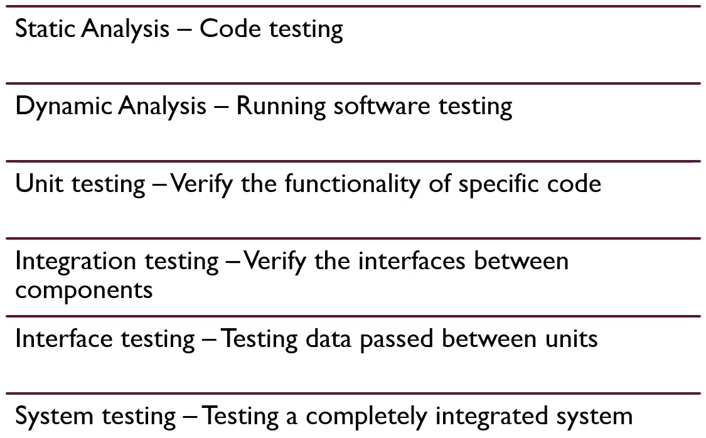

# Contents

# Introduction to Application Security

### Software Development Life Cycle (SDLC)

### SDLC - Designing

- Describe features and operations
  - Screen layout
  - Business rules
  - Process diagrams
  - Pseudo code and documentation
- Prototype work
- Detailed design
  - Technology choices
  - System architecture

### SDLC Goals

### Definition of Security

- Security is anything you do to protect an asset that is vulnerable to some attack, failure or error.
- An asset is anything you deem to have value.
  - holds value, produces value or provides access to value.
- Vulnerability is any weakness in an asset that makes it susceptible to attack or failure.
- An attack is any intentional action that can reduce the value of an asset. E.g., DDOS attack on web server or data center.
- Failures and errors are unintentional actions that can reduce the value of an asset. (power failure causing outrage to server)

- Steps:
  - Determining what assets we want to protect
  - Learn how the asset works and interact with other things
  - Determine how our asset's value is reduced directly and indirectly.
  - Take steps to mitigate the threats.

### Application Security Goals

- 3 Primary Pillars of Cybersecurity: Confidentiality, Integrity, Availability.
  - Confidentiality: Information is only available to those who should have access. (E.g., https)
  - Integrity: Data is known to be correct and trusted. (E.g., MD5 checksum, hashing)
  - Availability: Information is available for use by legitimate users when it is needed. (protecting something that produces value)

### Different Tests

### OWASP WebGoat

- <a href="https://owasp.org/www-project-webgoat/">OWASP WebGoat</a>
- `docker run -it -p 127.0.0.1:8080:8080 -p 127.0.0.1:9090:9090 -e TZ=Europe/Amsterdam webgoat/webgoat`
- http://localhost:8080/WebGoat

# OWASP Top 10

### Tools

- <a href="https://owasp.org/www-project-top-ten">Owasp Top 10</a>
- <a href="https://github.com/OWASP/CheatSheetSeries">OWASP Cheat Sheet</a>
- <a href="https://github.com/OWASP/SecurityShepherd">Security Shephard</a>
- <a href="https://owasp.org/www-project-webgoat">Webgoat</a>
- <a href="https://owasp.org/www-project-juice-shop">OWASP Juice Shop</a>
- <a href="https://www.zaproxy.org">OWASP ZAP (Zed Attack Proxy)</a>
- <a href="https://owasp.org/www-project-owtf">OWTF (Offensive Web Testing Framework)</a>
- <a href="https://owasp.org/www-project-application-security-verification-standard">OWASP AVS</a>
- <a href="https://owasp.org/www-project-secure-coding-practices-quick-reference-guide/">Secure Coding Practices Quick Reference Guide</a>
- <a href="https://owasp.org/www-project-code-review-guide/">Code Review Guidelines</a>

### OWASP TOp 10

1. Broken Access Control
   - Restrictions on what authenticated users are allowed to do are often not properly enforced.
   - Attackers can exploit these flaws to access unauthorized functionality and/or data, such as access other users' accounts, view sensitive files, modify other users' data, change access rights, etc.
2. Cryptographic failures
   - Failure to sufficiently protect data in transit or rest from exposure to unauthorized individuals.
   - This can include poor usage of encryption or the lack or encryption all together.
3. Injection
   - Injection flaws, such as SQL, NoSQL, OS, and LDAP injection, occur when untrusted data is sent to an interpreter as part of a command or query.
   - The attacker's hostile data can trick the interpreter into executing unintended commands or accessing data without proper authorization.
4. Insecure Design
   - Failing to build security into the application early in the design process through a process of threat modeling, and secure design patterns and principles.
5. Security Misconfiguration
   - Security misconfiguration is the most commonly seen issue.
   - This is commonly a result of insecure default configurations, incomplete or ad hoc configurations, open cloud storage, misconfigured HTTP headers, and verbose error messages containing sensitive information.
   - Not only must all operating systems, frameworks, libraries and applications be securely configured, they must be **patched/upgraded in a timely fashion**.
6. Vulnerable and Outdated Components
   - Components, such as libraries, frameworks, and other software modules, run with the same privileges as the application.
   - If a vulnerable component is exploited, such an attack can facilitate serious data loss or server takeover.
   - Applications and APIs using components with known vulnerabilities may undermine application defenses and enable various attacks and impacts.
7. Identification and Authentication Failures
   - Application functions related to authentication and session management are often implemented incorrectly, allowing attackers to compromise passwords, keys or session tokens, or to exploit other implementation flaws to assume other users' identities temporarily or permanently.
8. Software and Data Integrity Failures
   - Code or infrastructure that does not properly protect against integrity failures like using plugins from untrusted sources that can lead to a compromise.
9. Insufficient Logging and Monitoring
   - Insufficient logging and monitoring, coupled with missing or ineffective integration with incident response, allows attackers to further attack systems, maintain persistence, pivot to more systems, and tamper, extract or destroy data. Most breach studies show time to detect a breach is over 200 days, typically detected by external parties rather than internal processes or monitoring.
10. Server-Side Request Forgery (SSRF)
    - SSRF occurs when an application fetches resources without validating the destination URL.
    - This can be taken advantage of by an attacker who is able to enter a destination of their choosing.

### SANS Top 25

- Focuses on coding errors and software errors.
- OWASP Top 10 deals strict with vulnerabilities found in web applications.
- SANS Top 25 deals with weaknesses found in desktop and server applications as well.

- Examples:  
  
  

### Threat actors and more definitions

|          Terms          |                                                               Definition                                                               |
| :---------------------: | :------------------------------------------------------------------------------------------------------------------------------------: |
|     Confidentiality     |                              Concept of preventing the disclosure of information to unauthorized parties.                              |
|        Integrity        |                                      Refers to protecting the data from unauthorized alteration.                                       |
|      Availability       |                        Access to systems by authorized personnel can be expressed as the system's availability                         |
|     Authentication      |                                             Process of determining the identity of a user.                                             |
|      Authorization      | Process of applying access control rules to a user process, determining whether or not a particular user process can access an object. |
|   Accounting (Audit)    |                                                      Means of measuring activity.                                                      |
|     Non-Repudiation     |                       Concept of preventing a subject from denying a previous action with an object in a system.                       |
|     Least Privilege     |   Subject should have only the necessary rights and privileges to perform its current task with no additional rights and privileges.   |
|  Separation of Duties   |                             Ensures that for any given task, more than 1 individual needs to be involved.                              |
|    Defense in Depth     |                       Known by the terms layered security (or defense) and diversity defense. Layers of defense.                       |
|        Fail Safe        |            When a system experiences a failure, it should fail to a safe state. (Doors open when there is a power failure).            |
|       Fail Secure       |                       Default state is locked or secured. So a fail secure locks the door when power is removed.                       |
| Single point of failure |                                   Any aspect of a system that, if it fails, the entire system fails.                                   |

- Common Vulnerability Scoring System CVSS provides a way to capture the principal characteristics of a vulnerability and produce a numerical score reflecting its severity

  - low, medium, high, and critical

- Common Weakness Enumeration CWE is a community-developed list of common software security weaknesses.

### Defense in Depth

- Exploitation of a vulnerability by a threat results in risk.
- Defense in Depth may fail, don't solely rely on it.

### Proxy Tools

- Http request and response between client and server
- Proxy acts as an intermediary between client and web server.
  - Hence, what a proxy does, where proxy tool does, is that it sits between your browser and the web server and will actually proxy or capture that traffic and before ift is sent to the web server.
  - This gives you the ability to see what the request is and what that request looks like before it goes to web server and what that response from the web server is coming back (able to capture both the request and response - acts as an intermediary between browser and web server)
- E.g., chrome developer tools
- Can use OWASP Juice Shop to try

### API Security

- **Application Programming Interfaces (APIs)** allow the creation of discrete functionality that is available through a function or HTTP call to the functionality.
  - This allows for a modular approach to building an overall application.
  - For instance, JavaScript has APIs available that are built on top of the base language that allow the developer to integrate additional functionality:
  - Browser APIs Built into the browser, these expose data from the browser and environment that the browser is running in
  - 3rd Party APIs These are APIs that are pulled in from external sources that allow you to retrieve data and functionality from that 3rd party
    

### OWASP API Security Top 10

|  Broken object level authorization  |           Mass assignment           |
| :---------------------------------: | :---------------------------------: |
|        Broken authentication        |      Security misconfiguration      |
|       Excessive data exposure       |              Injection              |
| Lack of resource and rate limiting  |     Improper assets management      |
| Broken function level authorization | Insufficient logging and monitoring |

### Broken Object Level Authorization

- **Definition**
  Attacker substitutes ID of their resource in API call with an ID of a resource belonging to another user. Lack of proper authorization checks allows access. This attack is also known as IDOR (Insecure Direct Object Reference)

- **Example**
  An API that allows for an attacker to replace parameters in the URL that allows the attackers to have access to an API that they should not have access to. The API is not checking permissions and lets the call through.

- **Prevention**
  - Implement access checks on every call
  - Do not rely on user supplied IDs, only use IDs in the session object
  - Use random, non-guessable IDs

### Broken Authentication

- **Definition**
  Poorly implemented API authentication allowing attackers to assume other users' identities.

- **Example**
  Unprotected APIs, weak authentication, not rotating or reusing API keys, poor password usage, lack of token validation and weak handling

- **Prevention**
  - Check all authentication methods and use standard authentication, token generation/management, password storage, and MFA
  - Implement a strong password reset API
  - Authenticate the client calls to API
  - Use rate-limitations to avoid brute forcing

### Excessive Data Exposure

- **Definition**
  API exposing a lot more data than the client legitimately needs, relying on the client to do the filtering. Attacker goes directly to the API and has it all.

- **Example**
  Returning full data objects from the database or allowing for direct access to sensitive data.

- **Prevention**
  - Never rely on the client to filter data, and tailor API responses to the needs of the consumer. Ensure that there is a need-to-know for any PII returned
  - Ensure error responses do not expose sensitive information

### Lack of Resource and Rate Limiting

- **Definition**
  API is not protected against an excessive amount of calls or payload sizes. Attackers use that for DoS and brute force attacks.

- **Example**
  Attacker performs a DDoS or otherwise overwhelms the API.

- **Prevention**
  - Include rate limiting, payload size limits, check compression ratios, and limit container resources

### Broken Function Level Authorization

- **Definition**
  API relies on client to use user level or admin level APIs. Attacker figures out the "hidden" admin API methods and invokes them directly.

- **Example**
  Administrative functions that are exposed to non-admin users.

- **Prevention**
  - Deny all access by default and build permissions from there based on specific roles
  - Test authorization through tools and manual testing

### Mass Assignment

- **Definition**
  The API takes data that client provides and stores it without proper filtering for allow-listed properties.

- **Example**
  Payload received from the client is blindly transformed into an object and stored.

- **Prevention**
  - Do not automatically bind incoming data without validating it first through an explicit list of parameters and payloads that you are expecting
  - Use a readOnly schema for properties that should never be modified
  - Enforce the defined schemas, types, and patterns that are accepted

### Security Misconfiguration

- **Definition**
  Poor configuration of the APIs servers allows attackers to exploit them.

- **Example**
  Numerous issues like unpatched systems, overexposed files and directories, missing or outdated configuration, exposed systems and unused features, verbose error messaging.

- **Prevention**
  - Use of hardened images and secure default configuration
  - Automation to detect (and repair) discovered misconfiguration
  - Disable unnecessary features, and limit admin access

### Injection

- **Definition**
  Attacker constructs API calls that include SQL-, NoSQL-, LDAP-, OS- and other commands that the API or backend behind it blindly executes.

- **Example**
  SQL, LDAP, OS, XML injection

- **Prevention**
  - Never trust end-user input
  - Have well-defined input data: schemas, types, string patters, etc.
  - Validate, filter, sanitize and quarantine (if needed) data from users

### Improper Assets Management

- **Definition**
  Attacker finds non-production versions of the API: such as staging, testing, beta or earlier versions - that are not as well protected and uses those to launch the attack.

- **Example**
  Backwards compatibility can leave legacy systems exposed. Old and non-production versions can be poorly maintained yet still have access to production data. These also allow for lateral movement in the system.

- **Prevention**
  - Properly inventory your systems and APIs
  - Limit access to anything that should not be public and properly segregate prod and non-prod environments
  - Implement security controls on the network and system such as API firewalls
  - Have a decommission process for old APIs and systems

### Insufficient Logging and Monitoring

- **Definition**
  Lack of proper logging, monitoring, and alerting let attacks go unnoticed.

- **Example**
  Logging and alerts go unnoticed or are not responded to. Logs are not protected against tampering and are not integrated into a centralized logging system like a SIEM.

- **Prevention**
  - Properly log sensitive workflows like failed login attempts, input validation failures, and failures in security policy checks
  - Ensure logs are formatted so that they can be imported in a centralized tool. Logs also need to be protected from tampering and exposure to unauthorized users
  - Integrate logs with monitoring and alerting tools

# OWASP Top 10

### 1. Broken Access Control

#### Authentication vs Authorization

- **Authentication**
  - Providing and validating identity.
  - For example, when you need to access an online site or service, you usually have to enter your username and password.
- **Authorization**

  - Includes the execution rules that determines what functionality and data the user (or Principal) may access, ensuring the proper allocation of access rights after authentication is successful.
  - Process where requests to access a resource should be granted or denied. It should be noted that authorization is not equivalent to authentication.

- Having a license doesn't mean you are granted access to a military base. You have authentication, but not authorization.

|                                                                                Access Control                                                                                 |
| :---------------------------------------------------------------------------------------------------------------------------------------------------------------------------: |
|                                       Access control enforces policy such that users cannot act outside of their intended permissions.                                        |
|               Access control weaknesses are common due to the lack of automated detection, and lack of effective functional testing by application developers.                |
| Failures typically lead to unauthorized information disclosure, modification or destruction of all data, or performing a business function outside of the limits of the user. |
|     The technical impact is attackers acting as users or administrators, or users using privileged functions, or creating, accessing, updating or deleting every record.      |

- **Common Vulnerabilities**:

  - Violation of the principle of least privilege or deny by default, where access should only be granted for particular capabilities, roles or users, but is available to anyone.
  - Bypassing access control checks by modifying the URL, internal application state, or the HTML page, or simple using a custom API attack tool.
  - Permitting viewing or editing someone else's account, by providing its unique identifier (insecure direct object references).
  - Accessing API's that do not have proper access controls around HTTP verbs (PUT, POST, DELETE).
  - Elevation of privilege. Acting as a user without being logged in, or acting as an admin when logged in as a user.
  - Metadata (data that gives information about another data) manipulation, such as replacing or tampering with a JSON Web Token (JWT) access control token or a cookie or hidden field manipulated to elevate privileges, or abusing JWT invalidation.
  - CORS misconfiguration allows unauthorized API access.
  - Force browsing to authenticated pages as an unauthenticated user ot to privileged pages as a standard user. Accessing API with missing access controls for POST, PUT and DELETE Requests.
  - <a href="https://owasp.org/Top10/A01_2021-Broken_Access_Control/">Broken Access Control</a>

- **Prevention**
  - Apart from public resources, deny by default.
  - Implement access control mechanism once and re-use them through the application, including minimizing CORS usage.
  - Model access controls should enforce record ownership, rather than accepting that the user can create, read, update or delete any record.
  - Disable web server directory listing and ensure file metadata (e.g. git) and backup files are not present within web roots.
  - Log access control failures, alert admins when appropriate (e.g., repeated failures).
  - Rate limit API and controller access to minimize the harm from automated attack tooling.
  - JWT tokens should be invalidated on the server after logout.

### 2. Cryptographic Failures

- **3 types of information**

  - Protected Health Information (PHI)
    - Names, Dates, Phone/Fax, Numbers, Email, SSN, MRN, Account Num, Biometric (finger, retinal, voice prints), Images
  - Personally Identifiable Information (PII)
    - Name, Address, Passport, Vehicle Information, Drivers license, Credit Card numbers, Digital identity, birthplace, genetic information, login name.
  - Sensitive Financial Information
    - Credit/Debit card numbers and security codes, Account numbers, loan agreements, loan details, tax ID, PoS transactions

- **Cryptographic Failures**

  - Data transmitted in clear text
  - Old or weak algorithms used
  - No encryption enforced
  - Weak encryption keys generated
  - Untrusted certificate chain
  - Poor implementation of encryption
  - Weak hash functions used

- **Prevention**
  |Protecting data at rest|Access controls|Protecting data in motion|Memory Leaks|
  |:-:|:-:|:-:|:-:|
  |Application layer|Account/Data access based on role/privilege|Transport layer encryption|Secure compiler settings|
  |Database layer|Authenticated encryption instead of plain encryption|Digital Certificates (client & server-side)|Code quality/clean-up issues|
  |Filesystem-level|-|Payload encryption (PGP)|No insecure direct object references|
  |Media/Device Level|-|Randomly generated keys|-|
  |Don't collect and store unneeded sensitive data|-|-|-|

- **Example**:

  - A site doesn't use or enforce TLS for all pages or supports weak encryption.
  - An attacker monitors network traffic (e.g., at an insecure wireless network), downgrades connections from HTTPS to HTTP, intercepts requests, and steals the user's session cookie.
  - The attacker then replays this cookie and hijacks the user's (authenticated) session, accessing or modifying the user's private data.
  - Instead of the above, they could alter all transported data, e.g., the recipient of a money transfer

- <a href="https://owasp.org/Top10/A02_2021-Cryptographic_Failures/">Cryptographic Failures</a>

### 3. Injection

- **Injection**:

  - Anytime user input changes the intended behavior of the system.
  - Allow attackers to manipulate SQL statements sent to a database from the web application.
  - Exploits inadequate validation and sanitization of user-supplied input

- **How does it happen?**

  - Trust of user input without validating, filtering or sanitizing.
  - Dynamic queries are used directly in an interpreter without escaping.
  - Extracting additional information from by taking advantage weaknesses in search parameters used in object-relational mapping.
  - Using input directly in a SQL command that is used for queries or commands.

- **Potential impact of SQL Injection**

  - Steal all data from the database
  - Access PII/PHI/PCI Data
  - Takeover backend server or entire network
  - Remove data

- **Prevention**
  - Utilize a parametrized interface to the database.
  - Positive server-side input validation (i.e. allow-list of valid input)
  - Escape special characters in the query flow
  - Limit the return of records in a query using SQL controls like LIMIT (record count).

### 4. Insecure Design

- **Insecure Design**:

  - Security requirements or security reference architecture
  - Pave road methodology
  - Unsure of how application behave when it fails.
  - Document user stories (generate requirements), understand how the application is supposed to work.

- **Prevention**

  - Use a secure development lifecycle with security professionals for guidance.
  - Create secure design patterns and architecture that can be reused to create a paved road.
  - Threat model critical application workflows.
  - Write secure unit and integration tests that use abuse and misuse cases.
  - Design for segregation of tenants

- **Example**
  - A retail chain's e-commerce website does not have protection against bots run by scalpers buying high-end video cards to resell in auction websites at a higher price.
  - This creates terrible publicity for the video card makers and retail chain owners and enduring bad blood with enthusiasts who cannot obtain these cards at any price.
  - Careful anti-bot design and domain logic rules, such as purchases made within a few seconds of availability, might identify inauthentic purchases and rejected such transactions.

### 5. Security Misconfiguration

- **Security Misconfiguration**

  - Absence of security settings in:
    - Application, Framework, Database, Web server, Platform.
  - Lack of:
    - Patching
    - Secure settings for Parsers
  - Use of:
    - Outdated security configuration
    - Default settings/passwords
    - Overly verbose messaging when an error occurs (present too many details of an error message to the user.)
    - Out of data software

- **Prevention**:

  - Hardened secure defaults that are used to deploy in other environments in an automated method (to check if security settings are correct). Each environment should be configured identically with the same security controls.
  - Reduce the extra features and frameworks that are not needed or used.
  - Use a change management board to verify changes to environments and provide a gate for significant changes.
  - Segment components and use automated tools to verify configuration and detect drift.

- **Example**:

  - A cloud service provider (CSP) has default sharing permissions open to the Internet by other CSP users.
  - This allows sensitive data stored within cloud storage to be accessed.

- <a href="https://owasp.org/Top10/A05_2021-Security-Misconfiguration/">Security Misconfiguration</a>

### 6. Using Known Vulnerable Components

- What is a dependency

  - Third-party software.
  - Dependency is a broad software engineering term used to refer when a piece of software relies on another one.

- Vulnerable and outdated components

  - The term "Components" in the title of this category refers to application frameworks, libraries or other software modules integrated into an application; such components are usually written by a 3rd Party but this is not exclusive.
  - This category references using these components when they may have malicious code or security weaknesses within them (i.e. Vulnerable).

- Defense - Commercial

  - Most applications include either commercial products or Open Source Software (OSS) within their software bundles.
  - For commercial products, most major vendors such as Oracle, Google and IBM provide Security Bulletins to distribution lists for notification purposes.

- **Prevention**

  - For Open Source Software (OSS) libraries, find a solution like Dependency Check, GitLab, or Jfrog Xray, to automatically scan for vulnerable packages.
  - Sign up for regular security bulletins from the National Vulnerability Database (http://nvd.nist.gov/Home/Email-List) and regularly monitor components for security issues and updated versions.
  - Do not give extreme trust in any 3rd party components.
  - Always verify its size and checksum and download directly from vendor website, never a secondary party
  - Challenge the vendor to provide evidence of security vulnerability scanning. If possible, scan it yourself.
  - Use well-known vendors and sources that are maintained.
  - Remove unnecessary components from your code if they are not in use.

- **Notification**

  - Have a means for receiving notifications on potentially vulnerable software.
  - Many vendors like Microsoft already offer a notification service, however other services or feeds exist.
  - Receiving notifications is only part of the solution. Must be able to:
    - Know where to patch (what systems or software are vulnerable).
    - Have the ability to test the new patch.
    - Have a means to deliver the patch
    - Ability to notify those impacted by the changes to the system (users, customers, etc.)

- **Patching Process**
  - Development --> Pre-Prod --> Production
  - Run tests in Pre-Prod

### 7. Identification and Authentication Failures

- **How can authentication be broken**

  - Weak passwords allowed to be used
  - No, or weak, MFA enabled
  - Weak password recovery
  - Exposes session information
  - Weak password storage (no hash)
  - Session identifier reuse
  - Automated attacks like credential stuffing and brute force

- **Attacks**

  - Password guessing attack (social engineering)
    - E.g., John from IT, needs your help...
  - Dictionary attack
    - Dictionary words that are hashed and tested
  - Brute force attack
    - Guessing or targeted hashes
  - Username enumeration
    - Guessable patterns of usernames or log in failure messages that reveal too much
  - Phishing
    - Trick users into providing their credentials to an imposter; look-alike site

- **Account Recovery Risks**
  - Social Engineering
    - Emailing a password reset form without using something like 2 factor.
  - Easily guessable security answers:
    - "What school did you attend"
  - Password sent though insecure channels
    - Email
  - Password change not required:
    - Once you've been given a new password, it should be changed on the next login.

### 8. Software and Data Integrity Failures

- **Software Integrity Failures**

  - Development
    - Malicious code hosted at an attacker owned location
    - Malicious libraries that have been altered by an attacker
  - Production
    - Untrusted content in a CDN
    - Auto-update features that download unverified content

- **Prevention**
  - Only use libraries that can be verified with digital signatures
  - Only connect and use libraries from trusted repositories
  - Scan libraries for known vulnerabilities
  - Review code and configuration changes and segregate your CI/CD pipeline.

### 9. Security Logging and Monitoring Failures

- **Security Logging and Monitoring Failures**

  - Exploitation of insufficient logging and monitoring is the bedrock of nearly every major incident.
  - Attackers rely on the lack of monitoring and timely response to achieve their goals without being detected.
  - Most successful attacks start with vulnerability probing.
  - Allowing such probes to continue can raise the likelihood of successful exploit to nearly 100%.

- Insufficient logging, detection, monitoring and active response occurs at any time:

  - Auditable events, such as logins, failed logins, and high-value transactions are not logged.
  - Warnings or errors generate zero, inadequate, or unclear log messages.
  - Logs of applications and APIs are not monitored for suspicious activity or logs are only stored locally.
  - Appropriate alerting thresholds and response escalation processes are not in place or effective.
  - Penetration testing and scans by DAST tools (such as OWASP ZAP) do not trigger alerts.
  - The application is unable to detect, escalate, or alert for active attacks in real time or near real time.
  - Plans for monitoring, and response should be developed and well known to the organization.

- **Prevention**

  - Ensure all login, access control failures, and server-side input validation failures can be logged with sufficient user context to identify suspicious or malicious accounts, and held for sufficient time to allow delayed forensic analysis.
  - Ensure tha logs are generated in a format that can be easily consumed by a centralized log management solutions.
  - Ensure high-value transactions have an audit trail with integrity controls to prevent tampering or deletion, such as append-only database tables or similar.
  - Establish effective monitoring and alerting such that suspicious activities are detected and responded to in a timely fashion.
  - Establish or adopt an incident response and recovery plan.

- SIEM (Security Information and Event Management)
  - Gather all the logs here
  - Security analyst will check the logs using Artificial Intelligence or Machine Learning.

### 10. Server-Side Request Forgery (SSRF)

- SSRF

  1. Bad actor creates a specially crafted request
  2. The web server does not validate the resource it's being asked to fetch
  3. The web server is redirected to a location of the bad actor's choice

- **Prevention**
  - From Network Layer:
    - Segment remote resource access functionality in separate networks to reduce the impact of SSRF.
    - Enforce "deny by default" firewall policies or network access control rules to block all but essential intranet traffic.
  - From Application Layer:
    - Sanitize and validate all client-supplied input data
    - Enforce the URL schema, port and destination with a positive allow list
    - Do not send raw responses to clients
    - Disable HTTP re-directions
    - Be aware of the URL consistency to avoid attacks such as DNS rebinding and "time of check, time to use" (TOCTOU) race conditions.

# Defenses and Tools

### OWASP ZAP (Zed Attack Proxy)
