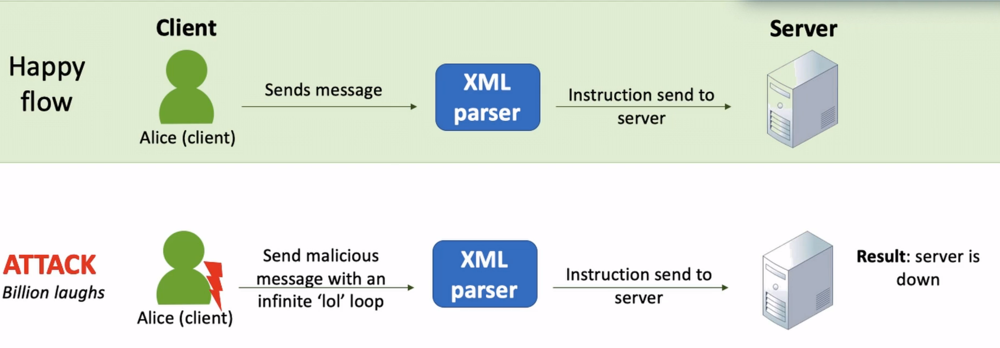
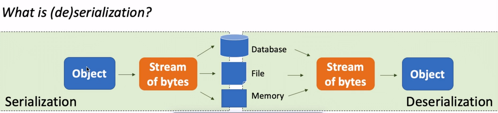

# Contents

<ul>
    <li>Injection</li>
    <li>Broken Authentication</li>
    <li>Sensitive Data Exposure</li>
    <li>XML External Entities</li>
    <li>Broken Access Control</li>
    <li>Security Misconfiguration</li>
    <li>Cross-Site Scripting (XSS)</li>
    <li>Insecure Deserialization</li>
    <li>Using Components with Known Vulnerabilities</li>
    <li>Insufficient Logging and Monitoring</li>
</ul>

# OWASP Top 10 Web Application Security

### Injection

- What is it? Untrusted user input is interpreted by server and executed
- What is the impact? Data can be stolen, modified or deleted.
- How to prevent?
  - Reject untrusted/invalid input data
  - Use latest frameworks
  - Typically found by penetration testers / secure code review
  - Never trust user input / always sanitise user input

### Broken Authentication and Session Management

- What is it? Incorrectly build auth and session man. scheme that allows an attacher to impersonate another user.
- What is the impact? Attacker can take identify of victim.
- How to prevent?
  - Don't develop your own authentication schemes.
  - Use open source frameworks that are actively maintained by the community.
  - Use strong passwords (incl. upper, lower, number, special characters)
  - Require current credential when sensitive information is requested or changed.
  - Multi-factor authentication (e.g., sms, password, fingerprint, iris scan, etc.)
  - Log out or expire session after X amount of time
  - Be careful with 'remember me' functionality.

### Cross-Site Scripting (XSS)

- What is it? Untrusted user input is interpreted by browser and executed.
- What is the impact? Hijack user sessions, deface websites (redirect to another website), change content.
- How to prevent?
  - Escape untrusted input data / Untrusting user input data.
  - Latest UI framework

### Broken Access Control

- What is it? Restrictions on what authenticated users are allowed to do are not properly enforced. Improper enforcement of authorization.
- What is the impact? Attackers can assess data, view sensitive files and modify data.
- How to prevent?

  - Application should not solely rely on user input; check access rights on UI level and server level for requests to resources (e.g., data).
  - Deny access by default.

  

### Security Misconfiguration

- What is it? Human mistake of misconfigurating the system (e.g., providing a user with a default password).
- What is the impact? Depends on the misconfiguration. Worst misconfiguration could result in loss of the system.
- How to prevent?

  - Force change of default credentials
  - Least privilege: turn everything off by default (debugging, admin interface, etc.)
  - Static tools that scan code for default settings.
  - Keep pacthing, updating and testing the system
  - Regularly audit system deployment in production
  - Contunuously scan for vulneribilities, train your staff and focus on building & shipping more secure products.

- E.g., Connecting default webcam online with the default password. Other people can login online to your webcam.

### Sensitive Data Exposure

- What is it? Sensitive data is exposed, e.g., soaicl security numbers, passwords, health records.
- What is the impact? Data that are lost, exposed or corrupted can have severe impact on business continuity.
- How to prevent?

  - Always obscure data (credit card numbers are almost always obscured).
  - Update cryptographic algorithm (MD5, DES, SHA-0 and SHA-1 are insecure).
  - Use salted encryption on storage of passwords.

- What is the difference between encryption at rest and in transit?
  - Encryption at rest covers stored data, while encryption in transit covers data in flux (i.e. moving from one point to another point).
  - There are new developments that encrypt data in use (e.g., by processor). An example of this is Microsoft confidential compute.

### Insufficient Attack Protection

- What is it? Applications that are attacked but do not recognize it as an attack , letting the attacker attack again and again.
- What is the impact? Leak of data, decrease application availability.
- How to prevent?

  - Detect and log normal and abnormal use of application
  - Respond by automatically blocking abnormal users or range of IP addresses.
  - Patch abnormal use quickly.

### Cross-site request forgery (CSRF)

- What is it? An attack that force a victim to execute unwanted actions on a web application in which they are currently authenticated.
- What is the impact? Victim unknowingly executes transactions.
- How to prevent?

  - Reauthenticate for all critical actions (e.g., transfer money)
  - Include hidden token in request
  - Most web frameworks have built-in CRSF protection, but isn't enabled by default.

  

### Using Components with Known Vulnerabilities

- What is it? Third-party components that the focal system uses (e.g., authentication frameworks), could be out of date
  - Third party component: A component written and/or maintained by open source community.
- What is the impact? Depending on the vulnerability, it could range from subtle to very bad.
- How to prevent?

  - Always stay current with third-party components
  - If possible, follow best practice of virtual patching.

- Can you efficiently detect known vulnerabilities in third-party components by reading the code?
  - No. Third-party code often contains hundreds (or thousands) lines of code. It is not efficient to read the code. Automated scanning tools can do this for you.

### Unprotected APIs

- What is it? Application expose rich connectivity options through APIs, in the browser to a user. These APIs are often unprotected and contain numerous vulnerabilities.
- What is the impact? Data theft, corruption, unauthorized access, etc.
- How to prevent?
  - Ensure secure communication between client browser and server API.
  - Reject untrusted/invalid input data
  - Use latest framework
  - Vulnerabilities are typically found by penetration testers and secure code reviewers.

### XML External Entities (XXE)

- What is it? Many older or poorly configured XML processors evaluate external entity references within XML documents.
- What is the impact? Extraction of data, remote code execution and denial of service attack.
- How to prevent?

  - Use JSON, avoid serialization (translation) of sensitive data.
  - Patch or upgrade all XML processors and libraries
  - Disable XXE and implement whitelisting.
  - Detect, resolve and verify XXS with static application security testing tools.

### Insecure deserialization

- What is it? Error in translations between objects
- What is the impact? Remote code execution, denial of service. Impact depends on type of data on that server.
- How to prevent?

  - Validate user input
  - Imoplement digital signatures on serialized objets to enforce integrity (cannot modify the message).
  - Restrict usahe and monitor deserializationa and log exceptions and failures. Review the log files.

- Serialization
  - Object --> stream of bytes --> database, file, memory
- Deserialization
  - database, file, memory --> stream of bytes --> object

- Example:

### Insufficient logging & monitoring

- What is it? Not able to witness or discover an attack when it happens or happened.
- What is the impact? Allows attacker to persist and tamper, extract, or detroy your data without you noticing it.
- How to prevent?
  - Log login, access control and server-side input validation features.
  - Ensure logs can be consumed easily, but cannot be tempered with. (logs cannot be adjusted)
  - Continuously improve monitoring and alerting process.
  - Mitigate impact of breach: Rotate (change keys of login credentials), Repave (repave to a last known good state) and Repair (when a patch is available, use it asap).

| State  |                         Description                          |
| :----: | :----------------------------------------------------------: |
| Rotate |   changes keys/password frequently (multiple times a day)    |
| Repave | restores the configuration to last good state (golden image) |
| Repair |  patches vulnerability as soon as the patches are available  |

### Cryptographic Failures

- What is it? Ineffective execution & configuration of cryptography (e.g., FTP, HTTP, MD5, WEP).
- What is the impact? Sensitive data exposure
- How to prevent?
  - Never roll your own crypto! Use well-known open source libraries
  - Static code analysis tools can discover this issue.
  - Key management (creation, destruction, distribution, storage and use).

### Insecure design

- What is it? A failure to use security by design methods/principles resulting in a weak or insecure design
- What is the impact? Breach of confidentiality, integrity and availability.
- How to prevent?

  - Secure lifecycle (embed security in each phase; requirements, design, development, test, deployment, maintenance and decommmissioning)
  - Use manual (e.g., code review, threat modelling) and automated (e.g., SAST and DAST) methods to improve security.

- **Security requirement**: don't need a single line of code to establish security requirement. For instance, the maximum tolerable downtime (MTO) of a system or process.

### Software and Data Integrity Failures

- What is it? An application that relies on updates from a trusted external source, however the update mechanism is compromised. Supplier got hacked
- What is the impact? Supply chain attack; data exfiltration, ransomware, etc.
- How to prevent?
  - Verify input (in this case software updates with digital signatures)
  - Continuously check for vulnerabilities in dependencies.
  - Use Software Bill of materials (get the current software materials that your supplier is using.)
  - Unconnected back ups

### Server-Side Request Forgery

- What is it? Misuse of prior established trust to access other resources. A web application is fetching a remote resource without validating the user-supplied URL.
- What is the impact? Scan and connect to internal services. In some cases, the attacker could access sensitive data.
- How to prevent?
  - Sanitize and validate all client-supplied input data
  - Segment remote server access functionality in separate networks to reduce the impact.
  - **Hardening**: Limiting connection to specific ports only (e.g., 443 for https)

# Defense

### Defense in depth

- Multiple layers of security.
- This multi-layered approach with intentional redundancies increases the security of a system as a whole and addresses many different attack vectors.
- Defense in Depth is commonly refered to as the "castle approach" because it mirrors the layered defenses of a medieval castle.
- Before you can penetrate a castle you are faced with the moat, ramparts, draw-bridge, towers, battlements and so on.

### Stride

- Identifying threats
- Examine what can go wrong
- What are you going to do about it
- Determine whether you are doing a job

- Spoofing (pretending to be someone else)
- Tampering (tampering with the evidence)
- Repudiation
- Information disclosure (dont want to disclose to unauthenticated users)
- Denial of service (server cannot handle too many requests and it denies other requests)
- Elevation of privilege (at first only got reading rights, but changed the system until we can "write" data.)

### Secure Development Processes

- Secure development process typically starts with formulating security requirements.

# FAQ

### How can you test whether your website uses the latest security protocols?

- Navigate to ssllabs.com to test the security protocols of your website for free.

### Where can I (legally) test my hacking skills for free?

- http://google.gruyere.appspot.com/

### What are insecure direct object references?

- What is it? A reference to a file, database or directory exposed to user via browser.
- What is the impact? Any user can navigate to almost any part of the system and attack the system by modifying the URL through the browser. E.g., modifying Excel sheets
- How to prevent?
  - Check access rights (e.g., proper authorization)
  - Inpur validation

